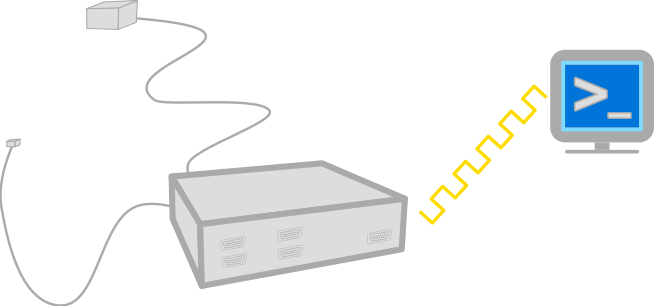
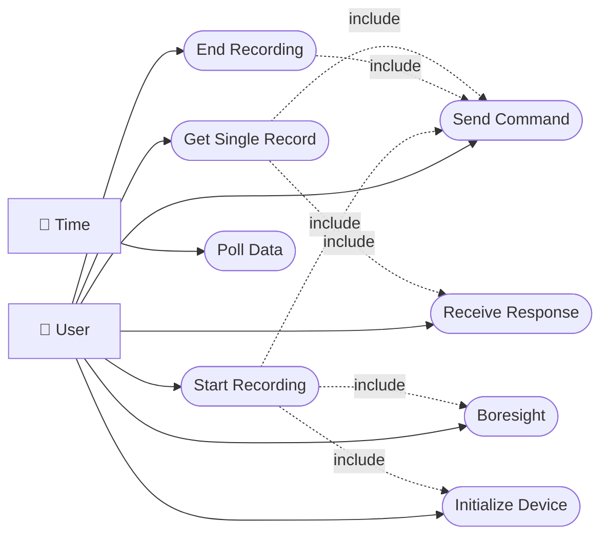
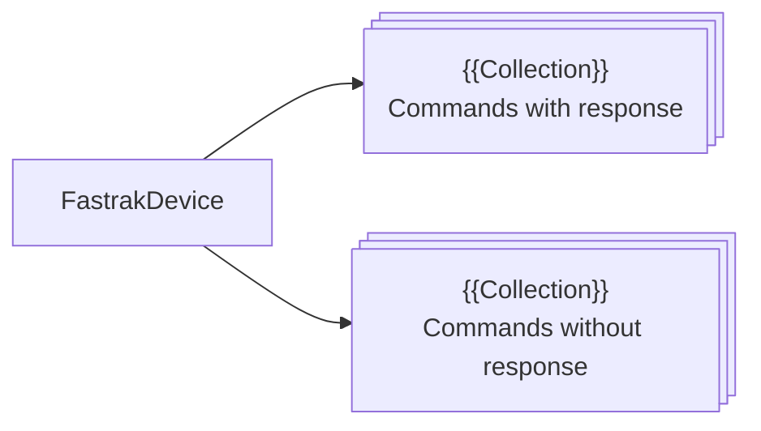
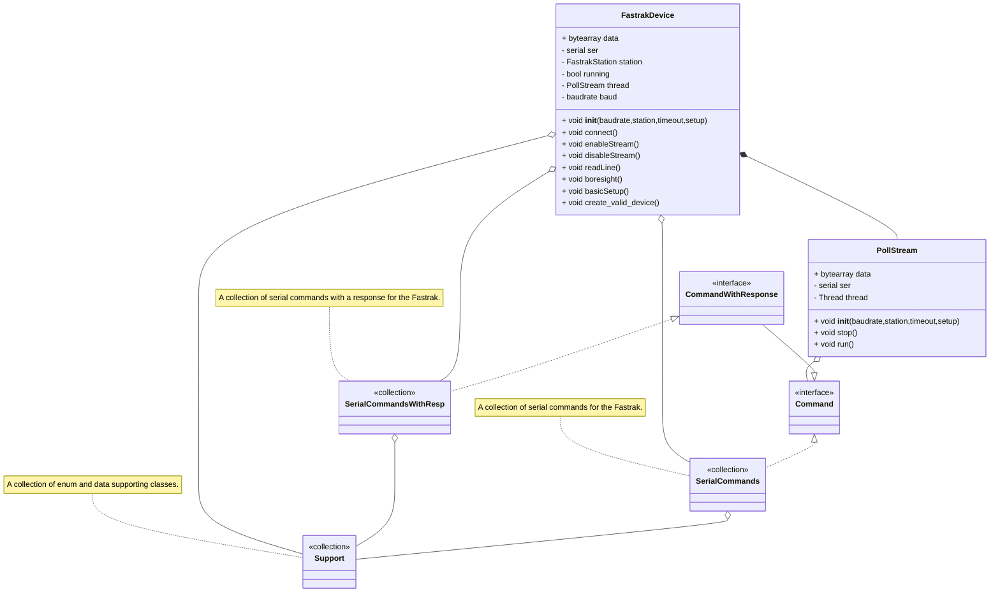

[](https://opensource.org/licenses/MIT)
[{width=10%}](https://brainmade.org)

{width=40%}

/// caption

///

## Note to Reader

### What Am I?

This repository contains an opinionated python serial driver for the
[Polhemus Fastrak](https://polhemus.com/all-trackers/fastrak). In this context opinionated means
initializes the Fastrak for a specific use case. We however supply interfaces for all serial
commands for the Fastrak.

### About the Documentation

The following document describes the "rules" and expectation for development. The
["Code Comments"](./content/code/) page contains the technical context descriptions found in the
source files. The ["Use Cases"](./content/use_cases/) page contains a collection of use cases and a
use case diagram for the tool. The ["Decisions"](./content/madr/) page contains a collection of
[architectural decision records](https://adr.github.io/madr/) [@Kopp2018] giving context on why this
tool is the way it is.

### Issues

If you discover an issue with this repository or have a question, please feel free to open an issue.
I've included templates for the following issues:

- 🖋️ Spelling and Grammar: Found some language that is incorrect?
- 🤷 Clarity: Found a section that just makes no sense?
- ❓ Question: Do you have a general question?
- 🐞 Bug: Found an error in the code?
- 🚀 Enhancement: Have a suggestion for improving the toolchain?

[:fontawesome-solid-paper-plane: Open Issue!](https://github.com/Nontrivial-Solutions/psychopy-6dof/issues/new/choose){ .md-button }

## 📃 Cite Me

## ⚖️ License

Documentation:
[](https://creativecommons.org/licenses/by-sa/4.0/)

Code:
[](https://opensource.org/licenses/MIT)

## Planning and Administration

### Tasks

Tasks are tracked as GitHub issues.

### Version Control

The toolchain shall be kept under Git versioning. Development shall take place on branches with
`main` on GitHub as a source of truth. GitHub pull requests shall serve as the arbiter for inclusion
on main with the following quality gates:

- Running and passing the unit test suite.
- Running and passing linting and style enforcers.
- Successful generation of documentation.

#### Release Tagging

The project shall be tagged when a new feature or bug fix is merged into main. The tag shall follow
[semantic versioning](https://semver.org) for labels.

```text
vMAJOR.MINOR.PATCH
```

### Project Structure

Files and directories shall be lower case, where capital is not required by a tool, and contain no
`' '`.

```text
📁 .
├── 📁 .github
│   ├── 📁 ISSUE_TEMPLATE
│   ├── 📁 PULL_REQUEST_TEMPLATE
│   ├── 📁 workflows
│   └── 📝 pull_request_template.md
├── 📁 .vscode
│   └── ⚙️ launch.json
├── 📁 docs
│   ├── 📁 content
│   ├── 📁 infra
│   └── 📖 README.md
├── 📁 src 
│   └── 🐍 __init__.py
├── ⚙️ .editorconfig
├── 🙈 .gitignore
├── 🛠️ .pre-commit-config.yaml
├── ⚙️ .rumdl.toml
├── ❄️ flake.lock
├── ❄️ flake.nix
├── 🛠️ Justfile
├── 📜 LICENSE
├── 📄 mkdocs.yml
├── 🐍 pyproject.toml
└── 🔒 uv.lock
```

### Directories of Interest

- docs: This directory contains the high level documentation for the tool.
- src: This directory contains the source code of the tool.
- .github: This directory contains the GitHub infrastructure.  
- .vscode: This directory contains the debugger configuration.  

### Define a Unit

A unit shall be a Python module.

### Quality

The tool and its units shall fail-safe, that is the tool and its units can fail, but the failure
must be detectable. A segfault is okay, an off by one error that computes the wrong value is not.

#### Unit Testing

Each internal unit shall have a unit test suite.

#### Integration Testing

The plugin shall have manual integration testing.

### Requirements

#### Use Cases

Requirements are described as a collection of [use cases](./content/usecase/usecase/) and
[actors](./content/usecase/actors/) which are collected into the following use case diagram:



##### Architectural Decisions

Architectural decisions [MADR](<https://github.com/adr/madr>) [@Kopp2018] serve as the primary
documentation for architectural decisions.

The following is the order of operations for the proposal of a MADR:

1. Create a branch for a proposal with the name:

    ```text
    proposal-{{short title}}
    ```

1. Create a pull request with this template.
1. In the branch create a Markdown file based on the
    [MADR Template](https://github.com/adr/madr/blob/4.0.0/template/adr-template.md). Name the
    Markdown file:

    ```text
    {{issue# padded to five digits}}-{{title}}
    ```

1. When a decision is made change the status to:
    - "accepted" and pull the branch into main branch
    - "rejected" and pull the branch into main branch

#### Nonfunctional Requirements

##### Colors

Diagrams included in documentation for features (use case and unit descriptions) are expected to use
the [COLORS](https://clrs.cc) color palette.

##### Technologies

###### Languages and Frameworks

- git
- Python
- mermaid.js
- prek
- tombi
- rumdl
- ruff
- uv
- MADR[@Kopp2018]

###### Documentation of Implementation

###### Code Style Guide

Python code shall be formatted with ruff using the included style settings. Markdown files shall be
formatted with ruff using the included style settings. TOML files shall be formatted with tombi
using the included style settings.

## Design and Documentation

### System

#### Block Diagram



#### Class Diagram



#### Unit Designs

Unit designs (and test description) for the FastrakDevice unit (public members and methods) is found
under [Unit Designs](./content/units). Designs for other units (commands and supporting classes) are
omitted.
