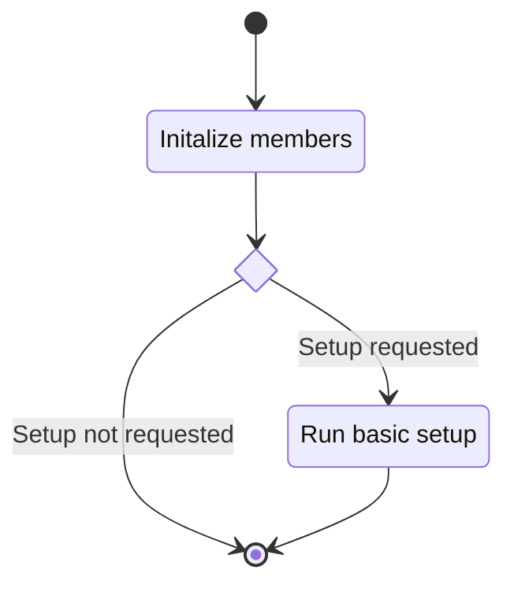
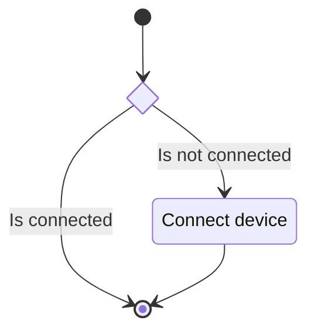
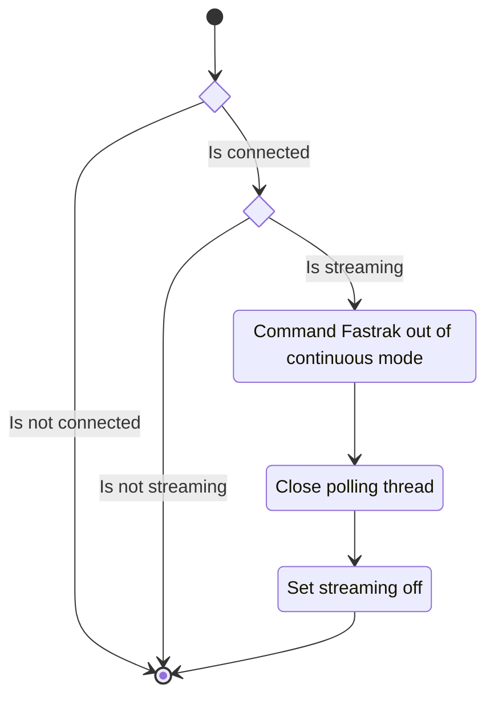
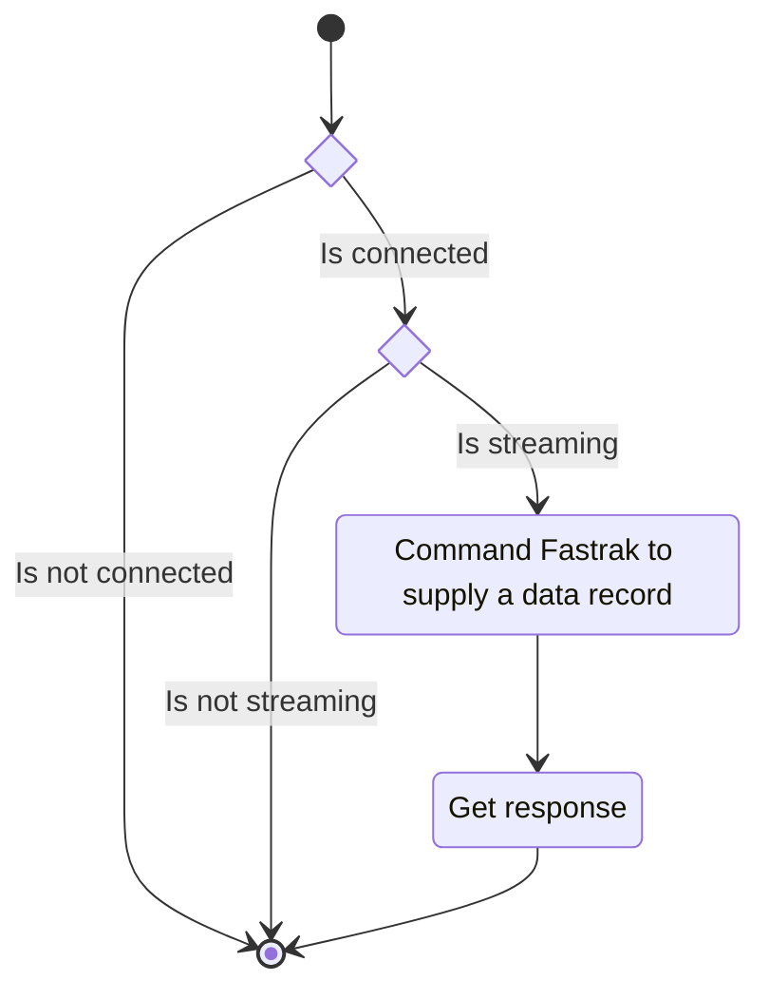
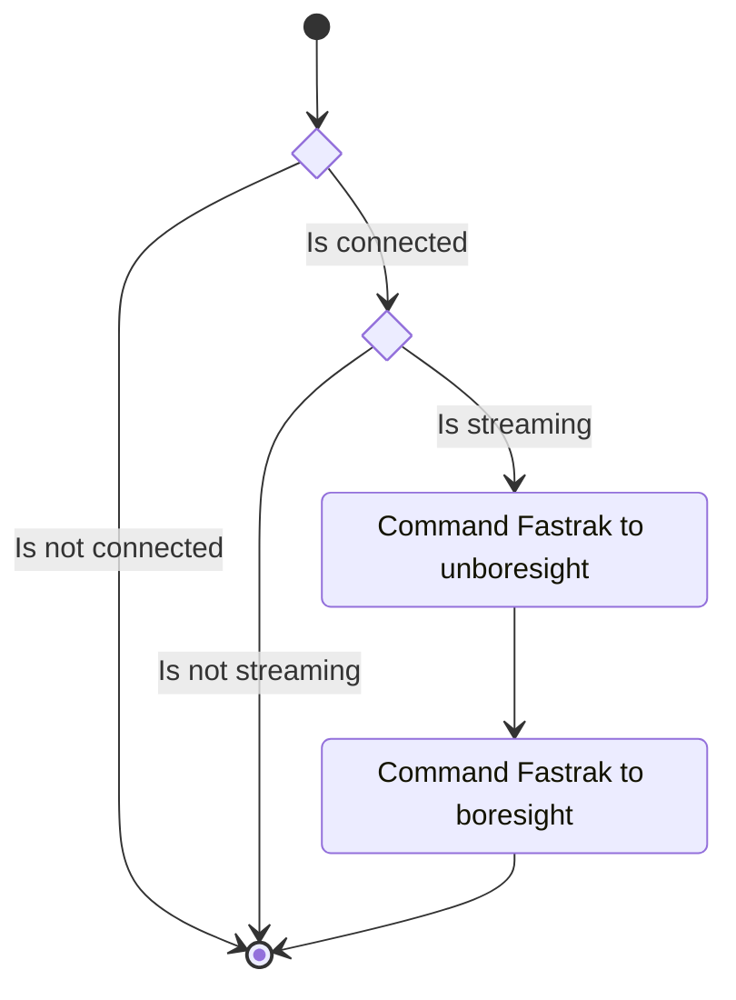
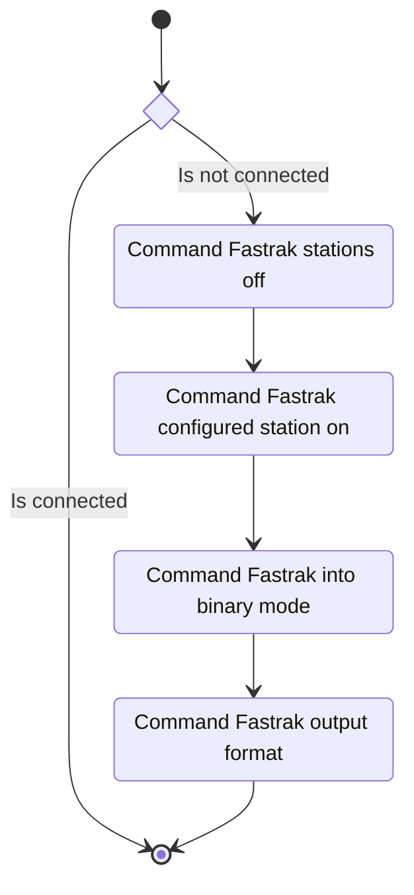

## Description

This unit describes the functionality of the Fastrak Device connection class. The class maintains a
serial connection to a physical Fastrak to which it issues commands.

### Members

#### Data

A `bytearray` of data from a data stream session.

### Interfaces

#### Constructor and Valid Class Function

The constructor method takes in a collection of data:

- Serial port name: A string representing which serial port to use to connect to the Fastrak.  
- Baudrate: A baudrate to use for the serial connection.
- Serial timeout: How long to wait for the serial connection.
- Station ID: The ID of the station (peripheral slot) to use on the Fastrak.
- Run setup flag: Indicates if the constructor should also set up the Fastrak.

##### State Machine

#### Connect

Attempt to connect the configured serial device.

##### State Machine

#### Enable Stream

Enable the streaming of data from a Fastrak device.

##### State Machine

#### Disable Stream

Disable the streaming of data from a Fastrak device.

##### State Machine

#### Read Line

Request a single data entry from the Fastrak.  

##### State Machine

#### Boresight

Zero the Fastrak.  

##### State Machine

#### Basic Setup

Run the basic setup for the Fastrak. This sets an active station and output data format.

##### State Machine

## Unit Test Description

### Constructor

#### Positive Tests

> [!test-card] "Initialized component"
>
> Data is passed to the constructor and stored in the private data.
>
> **Inputs:**
> 
> Each argument and all combinations of optional arguments.
>
> **Expected Output:**
>
> Positive response.

#### Negative Tests

No tests for the constructor.

### Connect

#### Positive Tests

> [!test-card] "Device Connected"
>
> A serial device is already connected to an instance of the class. The connect method is called.
>
> **Inputs:**
>
> An instance of the class with a mocked serial device connected.
>
> **Expected Output:**
>
> No response.
>

> [!test-card] "Device Not Connected"
>
> A serial device is not connected to an instance of the class. The connect method is called.
>
> **Inputs:**
>
> A serial mocked device available.
>
> **Expected Output:**
>
> A device is connected.
>

#### Negative Tests

No tests for the connect method.

### Enable Stream

#### Positive Tests

> [!test-card] "A stream is requested"
>
> A stream is requested to start.  
>
> **Inputs:**
>
> - A mocked serial device is connected.
> - A stream is not already running.
>
> **Expected Output:**
>
> The method returns successfully, and a stream is running.
>

> [!test-card] "A stream is running"
>
> A stream is requested to start, but the device is already streaming.  
>
> **Inputs:**
>
> - The mocked serial device is connected.
> - A stream is running.
>
> **Expected Output:**
>
> No response is given.
>

#### Negative Tests

> [!test-card] "A device is not connected"
>
> A stream is requested to start, but no serial device is connected.  
>
> **Inputs:**
>
> - The serial device is not connected.
>
> **Expected Output:**
>
> A disconnected exception is raised.
>

### Disable Stream

#### Positive Tests

> [!test-card] "A stream is requested to close"
>
> A stream is requested to stop.  
>
> **Inputs:**
>
> - A mocked serial device is connected.
> - A stream is running.
>
> **Expected Output:**
>
> The method returns successfully, and a stream is closed and marked not running.
>

#### Negative Tests

> [!test-card] "No stream is running"
>
> A stream is requested to stop, but the device is not streaming.  
>
> **Inputs:**
>
> - The mocked serial device is connected.
> - A stream is not running.
>
> **Expected Output:**
>
> A not running exception is raised.
>

### Read Line

#### Positive Tests

> [!test-card] "A single data frame is requested"
>
> A single data frame is requested from the Fastrak.  
>
> **Inputs:**
>
> - A mocked serial device is connected.
> - A stream is not running
>
> **Expected Output:**
>
> The device responds with a data frame.  
>

#### Negative Tests

> [!test-card] "A single data frame is requested"
>
> A single data frame is requested from the Fastrak.  
>
> **Inputs:**
>
> - A mocked serial device is connected.
> - A stream is running
>
> **Expected Output:**
>
> The device responds with an exception.  
>

> [!test-card] "A device is not connected"
>
> A data frame is requested, but no serial device is connected.  
>
> **Inputs:**
>
> - The serial device is not connected.
>
> **Expected Output:**
>
> A disconnected exception is raised.
>

### Boresight

#### Positive Tests

> [!test-card] "The boresight of a device is requested"
>
> The device is requested to boresight.  
>
> **Inputs:**
>
> - A mocked serial device is connected.
> - A stream is not running.
>
> **Expected Output:**
>
> No response.  
>

#### Negative Tests

> [!test-card] "The boresight of a device is requested"
>
> The device is requested to boresight.  
>
> **Inputs:**
>
> - A mocked serial device is connected.
> - A stream is running.
>
> **Expected Output:**
>
> An exception is raised.
>

> [!test-card] "A device is not connected"
>
> The device is requested to boresight, but no serial device is connected.  
>
> **Inputs:**
>
> - The serial device is not connected.
>
> **Expected Output:**
>
> A disconnected exception is raised.
>

### Basic Setup

#### Positive Tests

> [!test-card] "Command the device to basic setup state"
>
> The device is commanded into its normal operating state.  
>
> **Inputs:**
>
> - A mocked serial device is connected.
>
> **Expected Output:**
>
> No response.  
>

#### Negative Tests

> [!test-card] "A device is not connected"
>
> The device is commanded into its normal operating state, but no serial device is connected.  
>
> **Inputs:**
>
> - The serial device is not connected.
>
> **Expected Output:**
>
> A disconnected exception is raised.
>

> [!test-card] "Command the device to basic setup state, but stream is running"
>
> The device is commanded into its normal operating state, but a stream is running.  
>
> **Inputs:**
>
> - A mocked serial device is connected.
> - A stream is running.
>
> **Expected Output:**
>
> A streaming exception is raised.
>
