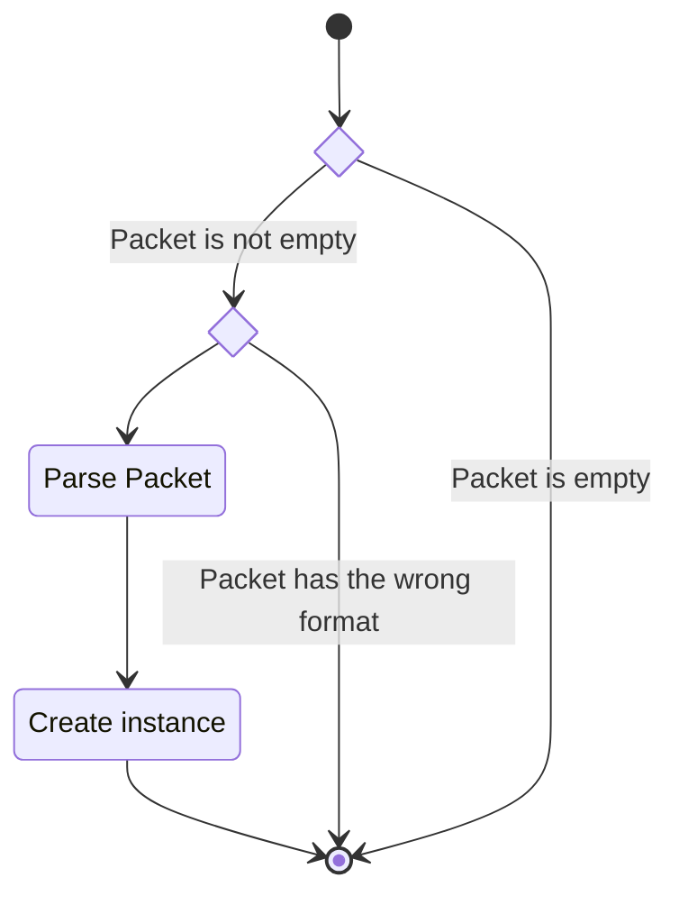

## Description

This unit describes the structure used to communicate the position of the

### Members

#### x,y,z

A float tuple for position of the tracker in $\R^3$.

#### $\psi,\theta,\varphi$

A float tuple for angular position of the tracker.

### Interfaces

#### Packet Parser

Takes in a data packet of the form

| MSB | 0          | 1    | 2-5 | 6-9  | 10-13 | 14-17  | 18-21    | 22-25     | 26   | 27   | LSB |
| --- | ---------- | ---- | --- | ---- | ----- | ------ | -------- | --------- | ---- | ---- | --- |
|     | Station ID | `\s` | x   | y    | z     | $\psi$ | $\theta$ | $\varphi$ | `\r` | `\n` |     |

and parses the data into an instance of this class.

##### State Machine

## Unit Test Description

### Packet Parser

#### Positive Tests

> [!test-card] "Valid data{#TestPosition_ID_001}"
>
> Valid data is passed to the packet parser and is parsed.
>
> **Inputs:**
> 
> The following positions:
>
> - 0,0,0,0,0,0
> - 1,1,1,1,1,1
> - -1,-1,-1,-1,-1,-1
> - 1,-1,1,-1,1,-1
> - 1,2,3,4,5,6
> - 0.1,0.1,0.1,0.1,0.1,0.1
> - 1.1,1.1,1.1,1.1,1.1,1.1
>
> **Expected Output:**
>
> Positive response.

#### Negative Tests

> [!test-card] "Invalid Data{#TestPosition_ID_002}"
>
> Invalid data is passed to the packet parser and is parsed.
>
> **Inputs:**
>
> The following positions:
>
> - 0
> - `b''`
> - 1.1,1.1,1.1,1.1,1.1,
> - 1.1,1.1,1.1,1.1,1.1,1.1,1.1
> - None
>
> **Expected Output:**
>
> None is returned  
>
